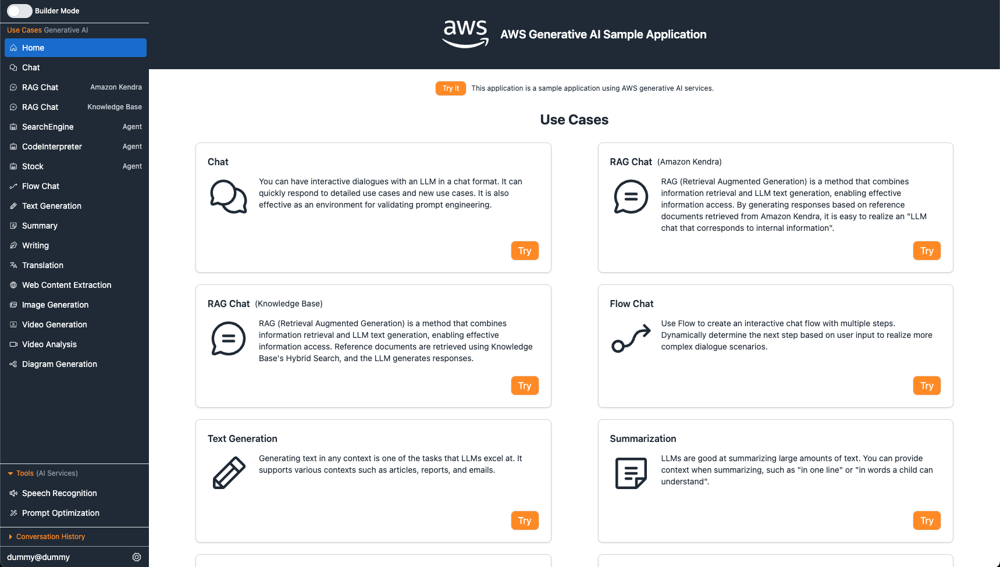
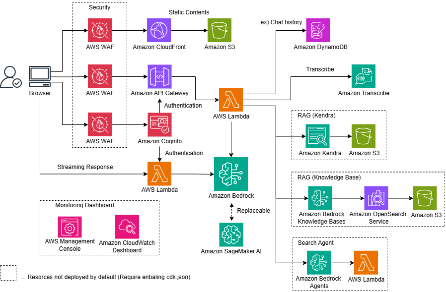

<div markdown="1" align="center">
  <h1>Generative AI Use Cases (GenU)</h1>

[](https://aws-samples.github.io/generative-ai-use-cases/index.html) [](https://github.com/aws-samples/generative-ai-use-cases/blob/main/LICENSE) [](https://github.com/aws-samples/generative-ai-use-cases/actions/workflows/node.js.yml) [](https://github.com/aws-samples/generative-ai-use-cases/actions/workflows/browser-extension.yml)

English

Well-architected application implementation with business use cases for utilizing generative AI in business operations

  
</div>

> [!IMPORTANT]
> GenU has supported multiple languages since v4.

## GenU Usage Patterns

Here we introduce GenU's features and options by usage pattern. For comprehensive deployment options, please refer to [this document](docs/en/DEPLOY_OPTION.md).

> [!TIP]
> Click on a usage pattern to see details

<details markdown="1">
  <summary><strong><ins>I want to experience generative AI use cases</ins></strong></summary>

GenU provides a variety of standard use cases leveraging generative AI. These use cases can serve as seeds for ideas on how to utilize generative AI in business operations, or they can be directly applied to business as-is. We plan to continuously add more refined use cases in the future. If unnecessary, you can also [hide specific use cases](docs/en/DEPLOY_OPTION.md#hiding-specific-use-cases) with an option. Here are the use cases provided by default.

  <br/>
  <br/>
  <table width="100%">
    <thead>
      <tr>
        <td width="20%">Use Case</td>
        <td width="80%">Description</td>
      </tr>
    </thead>
    <tbody>
      <tr>
        <td>Chat</td>
        <td>You can interact with large language models (LLMs) in a chat format. The existence of platforms that allow direct dialogue with LLMs enables quick responses to specific and new use cases. It's also effective as a testing environment for prompt engineering.</td>
      </tr>
      <tr>
        <td>Text Generation</td>
        <td>Generating text in any context is one of the tasks LLMs excel at. It generates all kinds of text including articles, reports, and emails.</td>
      </tr>
      <tr>
        <td>Summarization</td>
        <td>LLMs are good at summarizing large amounts of text. Beyond simple summarization, they can also extract necessary information in a conversational format after being given text as context. For example, after reading a contract, you can ask questions like "What are the conditions for XXX?" or "What is the amount for YYY?"</td>
      </tr>
      <tr>
        <td>Meeting Minutes</td>
        <td>Automatically generate meeting minutes from audio recordings or real-time transcription. Choose from Transcription, News Paper, or FAQ style with zero prompt engineering required.
        </td>
      </tr>
      <tr>
        <td>Writing</td>
        <td>LLMs can suggest improvements from a more objective perspective, considering not only typos but also the flow and content of the text. You can expect to improve quality by having the LLM objectively check points you might have missed before showing your work to others.</td>
      </tr>
      <tr>
        <td>Translation</td>
        <td>LLMs trained in multiple languages can perform translations. Beyond simple translation, they can incorporate various specified contextual information such as casualness and target audience into the translation.</td>
      </tr>
      <tr>
        <td>Web Content Extraction</td>
        <td>Extracts necessary information from web content such as blogs and documents. The LLM removes unnecessary information and formats it into well-structured text. Extracted content can be used in other use cases such as summarization and translation.</td>
      </tr>
      <tr>
        <td>Image Generation</td>
        <td>Image generation AI can create new images based on text or existing images. It allows for immediate visualization of ideas, potentially improving efficiency in design work. In this feature, LLMs can assist in creating prompts.</td>
      </tr>
      <tr>
        <td>Video Generation</td>
        <td>Video generation AI creates short videos from text. The generated videos can be used as materials in various scenarios.</td>
      </tr>
      <tr>
        <td>Video Analysis</td>
        <td>With multimodal models, it's now possible to input not only text but also images. In this feature, you can ask the LLM to analyze video frames and text inputs.</td>
      </tr>
      <tr>
        <td>Diagram Generation</td>
        <td>Diagram generation visualizes text and content on any topic using optimal diagrams. It allows for easy text-based diagram creation, enabling efficient creation of flowcharts and other diagrams even for non-programmers and non-designers.</td>
      </tr>
      <tr>
        <td>Voice Chat</td>
        <td>In Voice Chat, you can have a bidirectional voice chat with generative AI. Similar to natural conversation, you can also interrupt and speak while the AI is talking. Also, by setting a system prompt, you can have voice conversations with AI that has specific roles.</td>
      </tr>
    </tbody>
  </table>
</details>

<details markdown="1">
  <summary><strong><ins>I want to do RAG</ins></strong></summary>

RAG is a technique that allows LLMs to answer questions they normally couldn't by providing external up-to-date information or domain knowledge that LLMs typically struggle with.
PDF, Word, Excel, and other files accumulated within your organization can serve as information sources.
RAG also has the effect of preventing LLMs from providing "plausible but incorrect information" by only allowing answers based on evidence.

GenU provides a RAG Chat use case.
Two types of information sources are available for RAG Chat: [Amazon Kendra](docs/en/DEPLOY_OPTION.md) and [Knowledge Base](docs/en/DEPLOY_OPTION.md#enabling-rag-chat-knowledge-base-use-case).
When using Amazon Kendra, you can [use manually created S3 Buckets or Kendra Indexes as they are](docs/en/DEPLOY_OPTION.md#using-an-existing-amazon-kendra-index).
When using Knowledge Base, advanced RAG features such as [Advanced Parsing](docs/en/DEPLOY_OPTION.md#enabling-advanced-parsing), [Chunk Strategy Selection](docs/en/DEPLOY_OPTION.md#changing-chunking-strategy), [Query Decomposition](docs/en/DEPLOY_OPTION.md#enabling-rag-chat-knowledge-base-use-case), and [Reranking](docs/en/DEPLOY_OPTION.md#enabling-rag-chat-knowledge-base-use-case) are available.
Knowledge Base also allows for [Metadata Filter Settings](docs/en/DEPLOY_OPTION.md#metadata-filter-configuration).
For example, you can meet requirements such as "switching accessible data sources by organization" or "allowing users to set filters from the UI."

Additionally, it is possible to build a RAG that references data outside of AWS by [enabling MCP chat](docs/en/DEPLOY_OPTION.md#enabling-mcp-chat-use-case) and adding an external service's MCP server to [packages/cdk/mcp-api/mcp.json](/packages/cdk/mcp-api/mcp.json).

</details>

<details markdown="1">
  <summary><strong><ins>I want to use custom Bedrock Agents or Bedrock Flows within my organization</ins></strong></summary>

When you [enable agents](docs/en/DEPLOY_OPTION.md#enabling-agent-chat-use-case) in GenU, Web Search Agent and Code Interpreter Agent are created.
The Web Search Agent searches the web for information to answer user questions. For example, it can answer "What is AWS GenU?"
The Code Interpreter Agent can execute code to respond to user requests. For example, it can respond to requests like "Draw a scatter plot with some dummy data."

While Web Search Agent and Code Interpreter Agent are basic agents, you might want to use more practical agents tailored to your business needs.
GenU provides a feature to [import agents](docs/en/DEPLOY_OPTION.md#adding-manually-created-agents) that you've created manually or with other assets.

By using GenU as a platform for agent utilization, you can leverage GenU's [rich security options](docs/en/DEPLOY_OPTION.md#security-related-settings) and [SAML authentication](docs/en/DEPLOY_OPTION.md#saml-authentication) to spread practical agents within your organization.
Additionally, you can [hide unnecessary standard use cases](docs/en/DEPLOY_OPTION.md#hiding-specific-use-cases) or [display agents inline](docs/en/DEPLOY_OPTION.md#displaying-agents-inline) to use GenU as a more agent-focused platform.

Similarly, there is an [import feature](docs/en/DEPLOY_OPTION.md#enabling-flow-chat-use-case) for Bedrock Flows, so please make use of it.

Additionally, you can create agents that perform actions on services outside AWS by [enabling MCP chat](docs/en/DEPLOY_OPTION.md#enabling-mcp-chat-use-case) and adding external MCP servers to [packages/cdk/mcp-api/mcp.json](/packages/cdk/mcp-api/mcp.json).

</details>

<details markdown="1">
  <summary><strong><ins>I want to create custom use cases</ins></strong></summary>

GenU provides a feature called "Use Case Builder" that allows you to create custom use cases by describing prompt templates in natural language.
Custom use case screens are automatically generated just from prompt templates, so no code changes to GenU itself are required.
Created use cases can be shared with all users who can log into the application, not just for personal use.
Use Case Builder can be [disabled](docs/en/DEPLOY_OPTION.md#use-case-builder-configuration) if not needed.
Use cases can also be exported as .json files and shared with third parties. When sharing use cases, please be careful not to include any confidential information in prompts or usage examples. Use cases shared by third parties can be imported by uploading the .json file from the new use case creation screen.
For more details about Use Case Builder, please check <a href="https://aws.amazon.com/jp/blogs/news/genu-use-cases-builder/">this blog</a>.
<br/>
<br/>
While Use Case Builder can create use cases where you input text into forms or attach files, depending on your requirements, a chat UI might be more suitable.
In such cases, please utilize the system prompt saving feature of the "Chat" use case.
By saving system prompts, you can create business-necessary "bots" with just one click.
For example, you can create "a bot that thoroughly reviews source code when input" or "a bot that extracts email addresses from input content."
Additionally, chat conversation histories can be shared with logged-in users, and system prompts can be imported from shared conversation histories.
<br/>
<br/>
Since GenU is OSS, you can also customize it to add your own use cases.
In that case, please be careful about conflicts with GenU's main branch.

</details>

## Deployment

Deploy AWS resources with the following command. Please wait for the deployment to complete (it may take about 20 minutes).

```bash
# Quick deployment

# 1. Clone the repository:
git clone https://github.com/1CloudHub/Generative-Ai-use-cases.git
cd Generative-Ai-use-cases
 
# 2. Run environment check (optional):
chmod +x check_env.sh && ./check_env.sh
 
3. Deploy the CDK stack:
./deploy.sh 
```

Troubleshoot: Execute below command to troubleshoot if you face any permission errors during deployment

```bash
# Troubleshoot deployment
chmod +x deploy.sh
./deploy.sh
```

> [!IMPORTANT]
> Please enable the `modelIds` (text generation), `imageGenerationModelIds` (image generation), and `videoGenerationModelIds` (video generation) in the `modelRegion` region listed in [`/packages/cdk/cdk.json`](/packages/cdk/cdk.json). ([Amazon Bedrock Model access screen](https://us-east-1.console.aws.amazon.com/bedrock/home?region=us-east-1#/modelaccess))

GenU deployment uses [AWS Cloud Development Kit](https://aws.amazon.com/jp/cdk/) (CDK). If you cannot prepare a CDK execution environment, refer to the following deployment methods:

- [Deployment method using AWS CloudShell (if preparing your own environment is difficult)](docs/en/DEPLOY_ON_CLOUDSHELL.md)
- Workshop ([English](https://catalog.workshops.aws/generative-ai-use-cases)

First, run the following command. All commands should be executed at the repository root.

```bash
npm ci
```

If you've never used CDK before, you need to [Bootstrap](https://docs.aws.amazon.com/ja_jp/cdk/v2/guide/bootstrapping.html) for the first time only. The following command is unnecessary if your environment is already bootstrapped.

```bash
npx -w packages/cdk cdk bootstrap
```

Next, deploy AWS resources with the following command. Please wait for the deployment to complete (it may take about 20 minutes).

```bash
# Normal deployment
npm run cdk:deploy

# Fast deployment (quickly deploy without pre-checking created resources)
npm run cdk:deploy:quick
```

## Architecture



## Other Information

- [Deployment Options](docs/en/DEPLOY_OPTION.md)
- [Update Method](docs/en/UPDATE.md)
- [Local Development Environment Setup](docs/en/DEVELOPMENT.md)
- [Resource Deletion Method](docs/en/DESTROY.md)
- [How to Use as a Native App](docs/en/PWA.md)
- [Using Browser Extensions](docs/en/EXTENSION.md)

## Cost Estimation

We have published configuration and cost estimation examples for using GenU. (The service is pay-as-you-go, and actual costs will vary depending on your usage.)

- [Simple Version (without RAG) Estimation](https://aws.amazon.com/jp/cdp/ai-chatbot/)
- [With RAG (Amazon Kendra) Estimation](https://aws.amazon.com/jp/cdp/ai-chatapp/)
- [With RAG (Knowledge Base) Estimation](https://aws.amazon.com/jp/cdp/genai-chat-app/)
